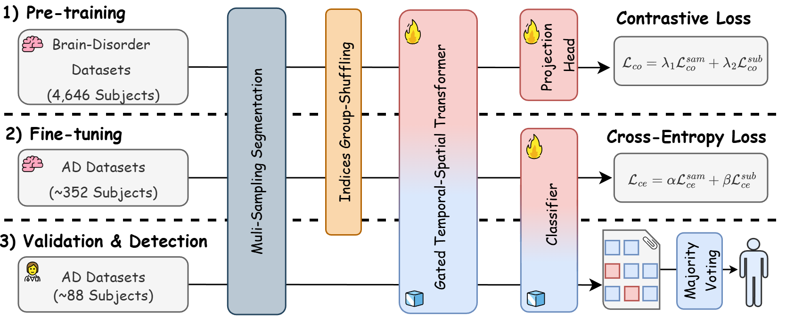
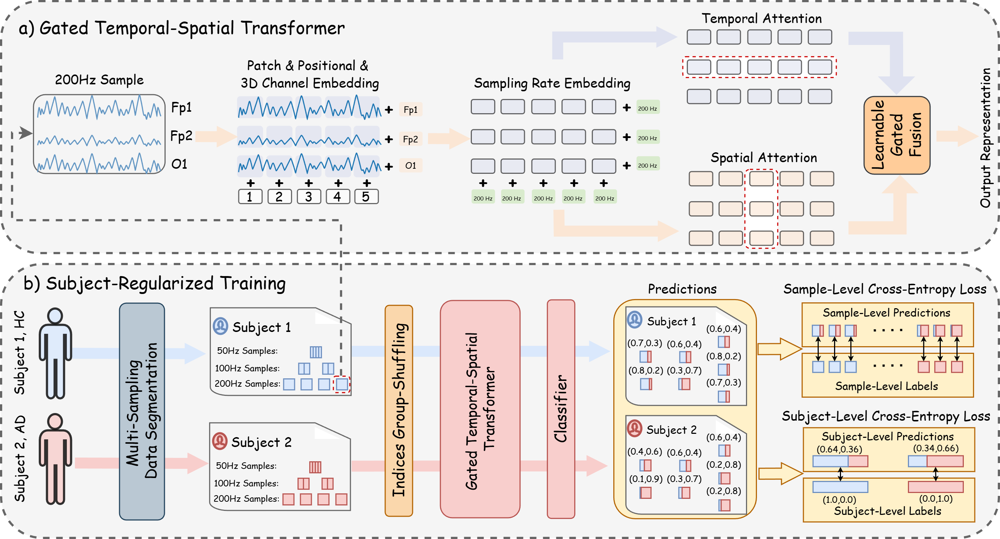
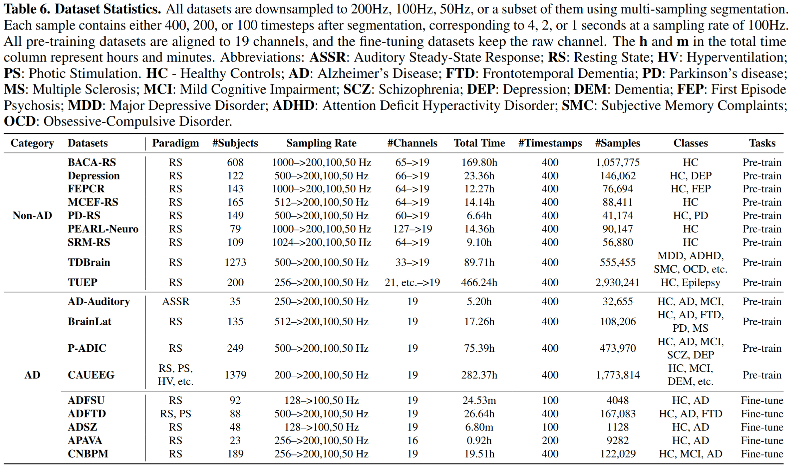

# LEAD: An EEG Foundation Model for Alzheimer's Disease Detection

## Overview


We train the world's first EEG foundation model for Alzheimer's Disease (AD) detection, named **LEAD**,
by leveraging the largest EEG-based AD detection dataset to date, which includes 2,238 subjects and 427.81 hours of EEG recordings.
The LEAD model is **adaptable to EEG data of any length, channel topologies, and diverse sampling rates**,
enabling flexible end-to-end subject-level AD detection.
The motivation for this work is to advance research in the domain of EEG-based AD detection and support researchers 
who face challenges in training models from scratch due to the limited number of AD subjects, 
as collecting EEG data from patients with AD is costly and time-consuming.


## Details

**a) Gated Temporal Spatial Transformer:** 
Input EEG samples are first sliced into univariate patches. 
These patches are mapped to patch embeddings, to which temporal positional embeddings, 
3D channel embeddings, and sampling rate embeddings are added to form the final patch representations. 
A parallel temporal-spatial attention mechanism is then applied along both the temporal and channel dimensions. 
The resulting features from the two dimensions are combined using a learnable gated fusion module. 
**b) Subject-Regularized Training.** 
Each subject’s EEG recordings are segmented into windows with varying sampling rates, 
such as 200 Hz, 100 Hz, and 50 Hz, using a multi-sampling segmentation strategy. 
Index group shuffling ensures that each training batch contains sufficient samples from the same subject, 
which facilitates subject-level learning. 
The classifier produces sample-level predictions that are aggregated into subject-level predictions. 
Both two-level predictions are used to compute cross-entropy losses.

## Datasets
### a) Data Curation
We refer to datasets that include Alzheimer's Disease (AD) subjects as AD datasets, 
while datasets that do not include AD subjects are called non-AD datasets. 
In total, we have 9 AD datasets and 9 non-AD datasets.

1) **AD Datasets.** We select 8 public AD datasets by reviewing EEG-based AD detection papers published between 2018 and 2026.
They are [AD-Auditory](https://openneuro.org/datasets/ds005048/versions/1.0.0), [ADFSU](https://osf.io/2v5md/), 
[ADFTD-RS](https://openneuro.org/datasets/ds004504/versions/1.0.8), [ADFTD-PS](https://openneuro.org/datasets/ds006036/versions/1.0.5), [ADSZ](https://figshare.com/articles/dataset/Alzheimer_s_disease_and_Schizophrenia/19091771), 
[APAVA](https://osf.io/jbysn/), [BrainLat](https://www.synapse.org/Synapse:syn51549340/wiki/624187), [P-ADIC](https://datadryad.org/dataset/doi:10.5061/dryad.8gtht76pw),
and [CAUEEG](https://github.com/ipis-mjkim/caueeg-dataset),
where ADFTD-RS and ADFTD-PS are two paradigms from the same ADFTD dataset.
Additionally, we use 1 private datasets: CNBPM, 
bringing the total number of AD datasets to 9.
Among them, 5 datasets include ADFSU, 
ADFTD, ADSZ, 
APAVA, and CNBPM, 
are used for downstream fine-tuning and the rest 4 datasets are used for pre-training.

2) **Non-AD Datasets.** We select 9 neurological disease or healthy large datasets, each with hundreds or even thousands of subjects. 
They are 
[BACA-RS](https://openneuro.org/datasets/ds005385/versions/1.0.2), 
[Depression](https://openneuro.org/datasets/ds003478/versions/1.1.0), 
[FEPCR-1](https://openneuro.org/datasets/ds003944/versions/1.0.1), 
[FEPCR-2](https://openneuro.org/datasets/ds003947/versions/1.0.1), 
[MCEF-RS](https://openneuro.org/datasets/ds005305/versions/1.0.1),
[PD-RS](https://openneuro.org/datasets/ds004584/versions/1.0.0), 
[PEARL-Neuro](https://openneuro.org/datasets/ds004796/versions/1.0.9), 
[SRM-RS](https://openneuro.org/datasets/ds003775/versions/1.2.1),
[TDBrain](https://www.synapse.org/Synapse:syn25671079/wiki/610278), 
and [TUEP](https://isip.piconepress.com/projects/nedc/html/tuh_eeg/),
where FEPCR-1 and FEPCR-2 are two parts from the same FEPCR dataset,
All of the Non-AD datasets are used for pre-training.

### b) Data Preprocessing
1) **Removal of non-EEG channels:** 
All non-EEG channels are removed, such as EOG, ECG, or coordinate information.
2) **Notch and Band-Pass Filtering:** 
Each trial undergoes a notch filter at 50 Hz or 60 Hz, 
followed by a band-pass filter between 0.5 Hz and 45 Hz. 
This step aims to suppress line noise, slow drifts, and high-frequency noise, 
which are generally outside the frequency range of scalp-recorded brain activity.
3) **Average re-referencing:** 
Average re-referencing is applied to reduce global noise and potential baseline shifts.
4) **Artifact Removal:** 
For datasets lacking prior artifact rejection, 
we utilize independent component analysis (ICA) combined with the ICLabel algorithm 
to automatically identify and remove components associated with artifacts like eye blinks, or muscle activity.
5) **Channel Alignment:** 
We align all pre-training datasets (downstream datasets could be 
an arbitrary number of channels and montage) to the standard 19-channel montage based on the international 10-20 system: 
Fp1, Fp2, F7, F3, Fz, F4, F8, T3/T7, C3, Cz, C4, T4/T8, T5/P7, P3, Pz, P4, T6/P8, O1, and O2. 
If a dataset has more channels, only the 19 channels with these names are selected, and the rest are discarded. 
For datasets employing different montages (e.g., Biosemi), 
signals are projected onto the target 19 channels using their 3D coordinates. 
All the fine-tuning datasets keep the raw channel.
6) **Frequency Alignment:** 
All datasets are resampled to a uniform sampling frequency of 200 Hz.
7) **Data Segmentation:**
We propose a **multi-sampling segmentation** strategy.
Instead of resampling all EEG signals to a single fixed sampling rate, 
we downsample each recording to multiple sampling rates. 
Specifically, signals with an original sampling rate above 200 Hz are downsampled to 200, 100, and 50 Hz, 
while those with lower sampling rates are downsampled to 100 and 50 Hz. 
These three choices could cover almost all sampling rates in scalp EEG datasets. 
The resulting 200 Hz, 100 Hz, and 50 Hz signals are then segmented 
into half-overlapping windows of 100, 200, or 400 timestamps, 
corresponding to 1-second, 2-second, or 4-second segments if at a sampling rate of 100 Hz. 
Segments shorter than 100, 200 or 400 timestamps at the boundaries are discarded.
8) **Z-Score Normalization:**
Z-score normalization is applied to each segmented sample, computed independently for each channel.
This step is computed during data loading, not in preprocessing files.


### c) Processed Datasets

1) **Datasets Statistics.** We pre-train on 13 datasets: **AD-Auditory**, **BrainLat**, **Depression**, **PEARL-Neuro**, **P-ADIC**, **BACA-RS**, **PD-RS**, **SRM-RS**, **TDBrain**, and **TUEP**, 
and fine-tuning on 5 downstream datasets: **ADFSU**, **ADFTD**, **ADSZ**, **APAVA**, and **CNBPM**. 
The pre-training datasets include 9 non-AD neurological diseases or healthy subjects and 4 AD datasets, 
totaling **4,646 subjects, 1,185.84 hours, and 7,431,484 samples**. 
The remaining 5 AD datasets are reserved for downstream evaluation, 
resulting in a total of **440 subjects, 47.59 hours, and 303,570** samples.
Download the raw data from the links above in Data Curation and 
run notebooks in the folder `data_preprocessing/` for each raw dataset to get the processed dataset.
2) **Datasets Folder Paths.**
Taking ADFTD as an example, the processed dataset is folder path is `dataset/L400/ADFTD/`,
where `L400` indicates that the length of samples in this dataset is 400 timestamps (2,4,8 second segments at 200,100,50 Hz).
The folder for each processed dataset has three files: `meta.json`, `X.dat`, and `y.dat`. 
   - `meta.json`: contains metadata information of the dataset, including the number of samples, timestamps, list of sampling rates, and channel names.
   - `X.dat`: contains the EEG features of all samples in the dataset, stored in a numpy memmap file with shape [N-sample, N-timestamp, N-channel].
   - `y.dat`: contains the labels of all samples in the dataset, stored in a numpy memmap file with shape [N-sample, 3],
       where each row is in the format of [label, subject_id / trial_id, sampling_rate_id]
3) **Processed Datasets Download link.** 
The 5 processed downstream datasets can be manually downloaded 
[here](https://drive.google.com/drive/folders/1y66f_Id-kal7q8uu-YYF2qTUHfhbPXOX?usp=drive_link) for quick start: 
.


## Requirements
The recommended requirements are specified as follows:  

* python 3.10+
* jupyter notebook
* einops==0.4.0
* matplotlib==3.7.0
* numpy==1.26.4
* pandas==1.5.3
* patool==1.12
* reformer-pytorch==1.4.4
* scikit-learn==1.5.0
* scipy==1.10.1
* sympy==1.11.1
* torch==2.5.1+cu121
* torchvision==0.20.1
* tqdm==4.66.3
* natsort==8.4.0
* timm==0.6.13
* transformers~=4.57.1
* mne==1.11.0
* mne-icalabel==0.8.1
* h5py==3.15.0
* pyedflib==0.1.42
* linear_attention_transformer==0.19.1
* timm~=0.6.13
* transformers~=4.57.1
  
The dependencies can be installed by:  
```bash  
pip install -r requirements.txt
```
Don't forget to install cuda version of pytorch in requirements.

## Reproduce Experiments
Before running, make sure you have all the processed datasets put under `dataset/`. 
You can see the scripts in `scripts/` as a reference. 
You could also run all the experiments by putting scripts line by line the `meta_run_leadv2.sh`,
`meta_run_leadv2_ablation_study.sh`, `meta_run_leadv2_case_study.sh`, and `meta_run_baseline_multi.sh` files.
The gpu device ids can be specified by setting command line `--devices` (e,g, `--devices 0,1,2,3`). 
You also need to change the visible gpu devices in script file by setting `export CUDA_VISIBLE_DEVICES` (e,g, `export CUDA_VISIBLE_DEVICES=0,1,2,3`). 
The gpus specified by commend line should be a subset of visible gpus.


Given the parser argument `--method`,`--task_name`, `--model`, and `--model_id` in `run.py`, 
the saved model can be found in`checkpoints/method/task_name/model/model_id/`; 
and the results can be found in  `results/method/task_name/model/model_id/`. 
You can modify the parameters by changing the command line. 
The meaning and explanation of each parameter in command line can be found in `run.py` file.


## Quick Start
Our pre-trained model P-Base can be downloaded [here](https://drive.google.com/drive/folders/1_XUfU3vZB40rjivkNYf8L2slCahXPo43?usp=drive_link)
and processed downstream datasets can be downloaded [here](https://drive.google.com/drive/folders/1y66f_Id-kal7q8uu-YYF2qTUHfhbPXOX?usp=drive_link).
After downloading, place the unzipped folder `P-Base` under `checkpoints/LEADv2/pretrain_lead/LEADv2/`.
Again, take the dataset ADFTD as an example, now you have data path located at `dataset/L400/ADFTD/` 
and pre-trained model path located at `checkpoints/LEADv2/pretrain_lead/LEADv2/P-Base/nh8_el12_dm128_df256_seed41/checkpoint.pth`.
Run following command to fine-tune the pre-trained model on ADFTD dataset:

```bash
python -u run.py --method LEADv2 --checkpoints_path ./checkpoints/LEADv2/pretrain_lead/LEADv2/P-Base/nh8_el12_dm128_df256_seed41/checkpoint.pth \
--task_name finetune --is_training 1 --root_path ./dataset/L400/ --model_id P-Base-F-ADFTD-Multi --model LEADv2 --data MultiDatasets \
--training_datasets ADFTD \
--testing_datasets ADFTD \
--e_layers 12 --batch_size 512 --n_heads 8 --d_model 128 --d_ff 256 \
--augmentations flip,frequency,jitter,mask,channel,drop --patch_len 50 --stride 50 --group_shuffle --group_size 8 --use_subject_loss --sampling_rate_list 200,100,50 \
--ratio_a 0.8 --ratio_b 0.9 --montage_name standard_1005 --channel_names Fp1,Fp2,F7,F3,Fz,F4,F8,T7,C3,Cz,C4,T8,P7,P3,Pz,P4,P8,O1,O2 --use_subject_vote --swa \
--classify_choice multi_class --cross_val mccv --des 'Exp' --itr 5 --learning_rate 0.0001 --train_epochs 200 --patience 15
```

Some important command line arguments are explained as follows:
- `--patch_len`: Length of each univariate patch.
- `--stride`: Stride between two adjacent univariate patches.
- `--group_shuffle`: Whether to use index group shuffling strategy during training.
- `--group_size`: Number of samples from the same subject in each index group.
- `--use_subject_loss`: Whether to use subject-level cross-entropy loss for subject-regularized training.
- `--sampling_rate_list`: List of sampling rates used in during training.
- `--ratio_a`: Ratio for total number of subjects in training set.
- `--ratio_b`: Ratio for total number of subjects in training and validation sets.
- `--montage_name`: Name of the montage used for current dataset.
- `--channel_names`: Comma-separated list of channel names used in current dataset (in order).
- `--use_subject_vote`: Whether to use subject-level voting strategy for subject-level detection during inference.
- `--swa`: Whether to use stochastic weight averaging (SWA) during training.
- `--classify_choice`: Choice of classification type, 'multi_class' denotes multi-class classification.
- `--cross_val`: Cross-validation strategy, 'mccv' denotes Monte Carlo subject-independent cross-validation.
- `--itr`: Number of running iterations.


## Apply on Your Own Dataset
To apply the LEAD model on your own EEG dataset for Alzheimer's Disease detection, please follow these steps:
1) **Data Preprocessing:** Preprocess your raw EEG data following the steps outlined in the "Data Preprocessing" section above. 
Ensure that your processed dataset is structured similarly to the provided processed datasets, including the `meta.json`, `X.dat`, and `y.dat` files.
You can refer to the preprocessing notebooks in the `data_preprocessing/` folder for guidance.
2) **Place Processed Dataset:** Place your processed dataset in the `dataset/` directory, following the naming convention used for other datasets (e.g., `dataset/L400/YourDatasetName/`).
3) **Fine-tune the Pre-trained Model:** Use the provided command line interface to fine-tune the pre-trained LEAD model on your dataset. Refer to the "Quick Start" section for an example command.
4) **Adjust Command Line Arguments:** Modify the command line arguments as needed to match your dataset's characteristics, such as `--montage_name`, `--channel_names`, and `--sampling_rate_list`.


## Acknowledgement
We want to thank the authors of the EEG datasets used in this paper for generously sharing their data. 
Their efforts and contributions have been invaluable in advancing the field of EEG and EEG-based Alzheimer’s Disease detection.